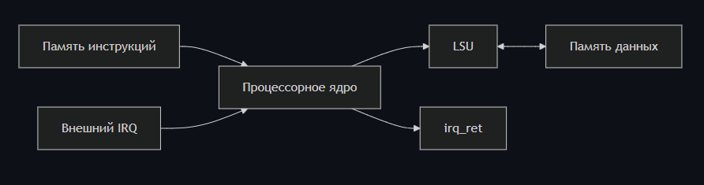
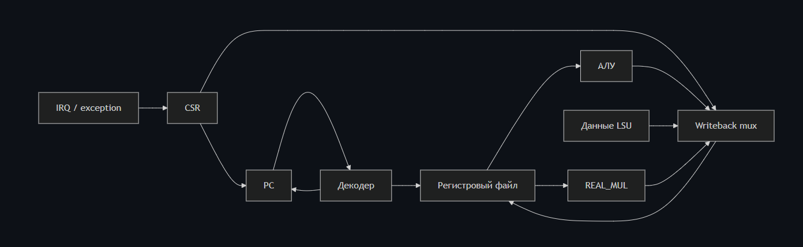

# Архитектура процессора

## Верхний уровень



`processor_system` связывает четыре основных блока:

- `instr_mem` — асинхронное чтение команд из ROM;
- `processor_core` — PC, декодирование, вычисление и writeback;
- `lsu` — формирование byte enable, выравнивание и расширение загружаемых данных;
- `data_mem` — синхронная память данных объёмом 512 байт.

## Ядро



Ядро выполняет инструкцию без классического конвейера. Счётчик команд
обновляется на фронте тактового сигнала, а LSU при обращении к памяти формирует
stall. При исключении или IRQ адрес следующей инструкции выбирается из `mtvec`;
`MRET` возвращает управление на адрес `mepc`.

## Поддерживаемые группы инструкций

| Группа | Инструкции |
|---|---|
| U-type | `LUI`, `AUIPC` |
| Переходы | `JAL`, `JALR` |
| Ветвления | `BEQ`, `BNE`, `BLT`, `BGE`, `BLTU`, `BGEU` |
| Загрузки | `LB`, `LH`, `LW`, `LBU`, `LHU` |
| Сохранения | `SB`, `SH`, `SW` |
| ALU immediate | `ADDI`, `SLTI`, `SLTIU`, `XORI`, `ORI`, `ANDI`, `SLLI`, `SRLI`, `SRAI` |
| ALU register | `ADD`, `SUB`, `SLL`, `SLT`, `SLTU`, `XOR`, `SRL`, `SRA`, `OR`, `AND` |
| System | CSR read/modify/write, `MRET` |
| Пользовательская | `REAL_MUL` для binary32 |

## Системный тест REAL_MUL

Тестовая программа выполняет:

```text
lui      x1, 0x00000
lui      x5, 0x3fc00       # 1.5f
lui      x6, 0x40000       # 2.0f
real_mul x7, x5, x6        # 3.0f
sw       x7, 0(x1)
jal      x0, 0
```

Критерий прохождения — значение `0x40400000` в первом слове памяти данных.
